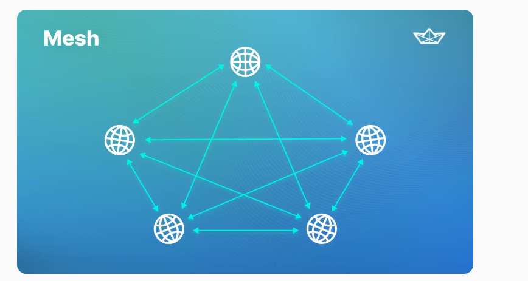
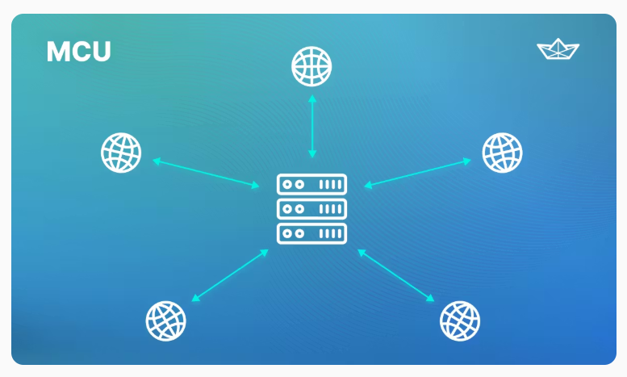
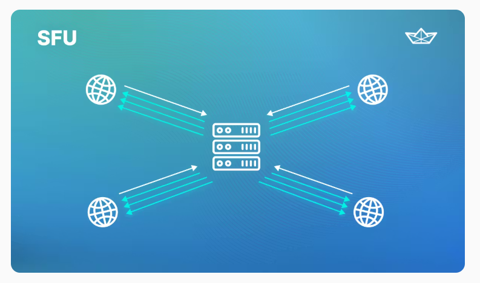

# HLD of MultiConference Video Call

**1. When we have only two people to talk**

**Ans:** P2P (Peer-To-Peer) WebRTC 
In this both peer connect with each other and share and receive audio and video. 
P2P networks are different from traditional client server network in which client is connector to central server. In P2P network there is no central server, instead each peer are equal and can to any other peer.

**2. When Multiple Peer are there(Mesh P2P)**

**Ans:** 

In P2P network each peer is equal and can connect to any other peer on the network.In order to connector two peer, they need to find each other on the network. To do this, each peer broadcast a message that contains its IpAddress other peer can reply on that message and connect.

**3. MCU (Multi Control Unit)**

**Ans:** 
A WebRTC MCU is a communication server that helps enable real time communication (RTC) between device and application. It stands for multi control Unit and allow for multiparty communication by integrating various audio and video into a single Stream.

MCU differ for P2P communication, in which each party has to send and receive media directly from the other party.

**4. SFU (Selective Forwarding Unit)**

**Ans:** 
SFU receive media from each party in a conference call, decides which stream should be forwarded to other parties and then forwards them.